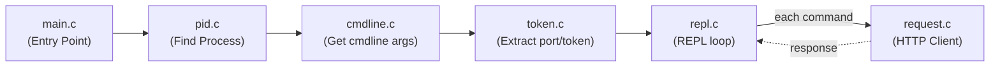

# LcuRepl

A **lightweight** C REPL (Read–Eval–Print Loop) for interacting with the LCU APIs.

## Usage

Launch `LcuRepl.exe` while the League of Legends client is running, then type the command at the prompt.
By default, LcuRepl will save the input history to the file named "LcuRepl_history.txt".

### Command Syntax

```text
[METHOD] <ENDPOINT> [DATA]
```

- **`METHOD`** _(Optional)_: `GET` (default), `POST`, `PUT`, `PATCH`, or `DELETE`.
- **`ENDPOINT`** _(Required)_: The LCU REST API path (e.g., `/lol-summoner/v1/current-summoner`). You can look up available endpoints at [lcu.kebs.dev](https://lcu.kebs.dev/).
- **`DATA`** _(Optional)_: JSON body payload for write requests.

---

### REPL Commands

In addition to LCU API requests, the REPL supports the following built-in commands:

| Command  | Description                                    |
| -------- | ---------------------------------------------- |
| `.help`  | Show usage instructions and available commands |
| `.clear` | Clear the terminal screen                      |
| `.exit`  | Exit the REPL (equivalent to `Ctrl+D`)         |

### Input History

LcuRepl automatically saves every command you enter to a local history file, `LcuRepl_history.txt`, created in the working directory on first launch. Use the **Up/Down arrow keys** to navigate through previous commands.

---

### Examples:

```powershell
>>> GET /riotclient/app-name
"LeagueClient"
>>> POST /lol-summoner/v2/summoners/names ["召唤师2321#55777"]
[{"accountId":0000000000,"displayName":"","gameName":"召唤师2321","internalName":"","nameChangeFlag":false,"percentCompleteForNextLevel":18,
"privacy":"PUBLIC","profileIconId":7061,"puuid":"00000000-a2f3-5260-a16e-000000000000","rerollPoints":{"currentPoints":500,"maxRolls":2,
"numberOfRolls":2,"pointsCostToRoll":250,"pointsToReroll":0},"summonerId":0000000000,"summonerLevel":199,"tagLine":"55777","unnamed":true,
"xpSinceLastLevel":676,"xpUntilNextLevel":3648}]
>>>
```

## Build

### Prerequisites

- Windows OS
- [MSYS2](https://www.msys2.org/), with the following packages installed:
  - `mingw-w64-x86_64-gcc`
  - `mingw32-make`

### Compiling

Open PowerShell or an MSYS2 MinGW terminal in the project directory and run:

```powershell
mingw32-make.exe
```

To remove build artifacts:

```powershell
mingw32-make.exe clean
```

## Implementation Detail



## Acknowlegement

- [isocline](https://github.com/daanx/isocline)
